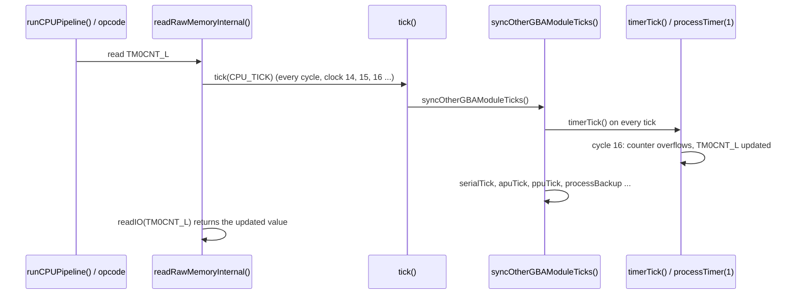
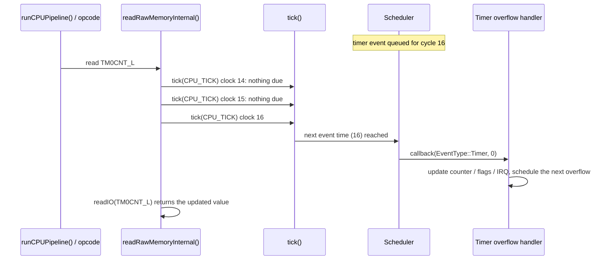

# GBA event scheduler: notes

The GBA core isn't reaching 60 fps consistently, so timing moves to a scheduler. Only the GBA core uses it; the other cores stay as they are.

---

## 1. Core execution model and synchronization

- **Fine-grained bus-cycle interception:** instead of running coarse instruction blocks with a blind post-execution catch-up, execution is managed at the precise atomic heartbeat of the machine (individual bus cycles and idle cycles).
- **Sub-cycle precision:** by integrating the scheduler catch-up / tick directly into core functions like `cpuIdleCycles()` and `busCycles()`, events fire atomically on their exact target cycle without instruction-overshoot delays.
- **The loop sequence:**
  1. Peek: check `scheduler.peek_next_timestamp()` to see when the next hardware event is due.
  2. Fine-grained stepping: advance execution cycle by cycle via `busCycles()` / `cpuIdleCycles()`.
  3. Advance clock: increment the master cycle counter per bus cycle.
  4. Atomic interception (tick): fire due event callbacks right inside the cycle function, before subsequent register reads occur.

## 2. Scheduler component design

- **Global clock:** a 64-bit unsigned integer (`uint64_t`) tracking total master cycles, eliminating any risk of wrap-around.
- **Priority queue and determinism:** events are stored in a priority queue sorted primarily by target timestamp, with a secondary priority/tie-breaker value to ensure a deterministic execution order when multiple hardware events land on the exact same cycle.
- **Event payload:** an `EventType` enum and an integer context/identifier are passed directly to flexible callback functions, so handlers can identify which subsystem (e.g. Timer 0, Timer 1, DMA) is firing.

## 3. Public API

```cpp
void     reset();                                    // clears the event queue and resets the master cycle counter to zero
uint64_t get_current_cycles() const;                 // current global master cycle count
uint64_t peek_next_timestamp() const;                // target time of the next queued event for CPU budget clamping
void     schedule(EventType type, uint64_t target_cycle, int context = 0);        // inserts a new event with its priority tie-breaker
void     cancel(EventType type, int context = 0);                                 // removes a pending event
void     reschedule(EventType type, uint64_t new_target_cycle, int context = 0);  // updates an active event's trigger time in place
void     tick(uint64_t current_master_cycle, CallbackFunc callback);              // processes all due events up to the current master clock and triggers their callbacks
```

The scheduler goes in `core/` as `scheduler.h` / `scheduler.cpp` (generic).

## 4. Initialization workflow

- **Manual reset:** hardware components (CPU, PPU, timers, etc.) are manually reset to their power-on states before the emulation loop starts (no need to schedule startup events).
- **Bootstrapping:** initial recurring events (such as the first scanline or timer ticks) are pre-scheduled into the queue, after which the main execution loop takes over.

## 5. Functional call sequences

### Current method (reactive / inline polling)

Every instruction or block explicitly increments a local counter (`cpuCounter`), and `syncOtherGBAModuleTicks()` immediately updates timers, APU, PPU and serial inline for every single cycle spent.

1. `processSOC()` calls `runCPUPipeline()`
2. `runCPUPipeline()` executes instructions, returns cycles spent via `cpuCounter`
3. `processSOC()` calls `syncOtherGBAModuleTicks(cpuCounter)`
4. `syncOtherGBAModuleTicks()` is blind-ticked inline per block:
   - `timerTickSpecific()`
   - `ppuTick()`
   - `apuTick()`
   - `serialTick()`

### Proposed method (fine-grained bus-cycle interception scheduler)

Execution steps cycle by cycle through `cpuIdleCycles()` and `busCycles()`, so event callbacks fire atomically at the exact sub-cycle boundary, without multi-cycle instruction overshoots.

1. `processSOC()` calls `scheduler.peek_next_timestamp()`
2. Scheduler returns the next target cycle
3. CPU execution enters `cpuIdleCycles()` / `busCycles()` per individual cycle
4. Master clock increments the master cycle count per bus/idle cycle
5. Scheduler tick is invoked directly inside `cpuIdleCycles()` / `busCycles()`
6. Event firing: pops due events and invokes callbacks atomically at the target cycle:
   - `callback(EventType::Timer, context)` triggers `timerTickSpecific(context)`
   - `callback(EventType::PPU, context)` triggers `ppuTick()`

### Example: a timer event due at cycle 16, with the CPU reading the timer register on that cycle

The rule: the timer event is processed before the CPU's read on cycle 16, so the CPU doesn't get stale data.

Current method:



Proposed method:



## 6. Tick types, free bus cycles and integration

**Tick types and call wrappers in the codebase**

- **`cpuIdleCycles()`:** the I-cycles (internal cycles) of the CPU. Called exclusively from the ARM7TDMI opcodes and interrupt handlers. Depending on whether DMA is running, it triggers `dmaTick()` or falls back to `busCycles()`.
- **`busCycles()`:** invoked independently in specific cases such as HALT<->UNHALT transitions, or HALTing when DMA is not running. It invokes the unified `tick(TICK_TYPE::CPU_TICK)` for the CPU only (not DMA).
- **`dmaTick()`:** a wrapper for DMA processing. Invoked during HALT (if DMA is running), from `cpuIdleCycles()` (if DMA is running), and from the memory access functions (`readRawMemoryInternal` / `writeRawMemoryInternal`) when the source is DMA.
- **`tick(TICK_TYPE type)`** (was `cpuTick`): the unified wrapper to handle either a CPU tick or a DMA tick (since CPU and DMA cannot run in parallel on the GBA when accessing the bus; internal cycles are a special case). Irrespective of the tick type (`CPU_TICK` or `DMA_TICK`), the synchronization function (`syncOtherGBAModuleTicks`) is called.
  - If `type == TICK_TYPE::DMA_TICK`: increments `dmaCounter` and triggers synchronization.
  - Else (CPU tick): increments `cpuCounter` and triggers synchronization.

**Memory read/write branching**

Memory read and write functions explicitly branch based on whether the memory source is DMA or CPU:

- For DMA access: calls `tick(TICK_TYPE::DMA_TICK)` in a loop for each DMA access cycle.
- For CPU access: calls `tick()` in a loop for each CPU access cycle.

**Special case: free bus cycles counter** (NBA-inspired, and "CPU runs idles during DMA")

- As verified against the AGBEEG test suite ("CPU Runs Idles During DMA"), the GBA hardware allows the CPU to continue running and complete any internal/idle cycles (such as those from a `mul` opcode) while DMA is active. The CPU is only stalled once it actually attempts to access the bus, because it cannot gain bus access while DMA is actively using it.
- Because the emulator cannot cycle the CPU and DMA in parallel, an NBA-inspired design is used: when DMA becomes active on an internal CPU cycle, the total DMA duration is tracked, and subsequent internal CPU cycles are treated as "free" (tracked via `freeBusCyclesCounter`) until the CPU accesses the bus or exceeds the DMA duration. This ensures that wherever `freeBusCyclesCounter` is non-zero (either in the read/write functions or during internal cycles), the emulator correctly ticks the DMA/free cycles without observable side effects.

**Checked against the code** (where the text above differs from the source; delete this block if you'd rather keep the text exactly as written)

- Section 5, current method: `syncOtherGBAModuleTicks()` takes no argument and is not called from `processSOC()`. It is called from `tick()` on every cycle, and the timer call is `timerTick()` (there is no `timerTickSpecific()`).
- Sections 1 and 5, proposed method: the memory read/write loops call `tick()` directly, not through `busCycles()` / `cpuIdleCycles()`. Hooking only those two would miss the access cycles, so the scheduler check has to be in `tick()`.
- Section 6, `dmaTick()`: `readRawMemoryInternal` / `writeRawMemoryInternal` call it when the source is the **CPU** (`CPU` or `CPU_INSTRUCTION_FETCH`, not `LOCK`) and DMA is running, and that's also where `freeBusCyclesCounter` is reset to 0. When the source is DMA, they just loop `tick(DMA_TICK)`.
- Section 6, `cpuIdleCycles()`: after `dmaTick()` the DMA ticks counted in `dmaCounter` move into `freeBusCyclesCounter`. `busCycles()` is only called when `freeBusCyclesCounter == 0`; otherwise a free cycle is consumed with no tick.

## 7. Events

### Timers

Candidate events:

- timer overflow (context = timer 0 to 3)
- timer Control write
- timer Reload write

Idea: schedule the timer register write as an event 1 cycle later, which would replace `GBA_ENABLE_DELAYED_TIMER_REG` in scheduler mode.

### Other events

To be added.
